Github地址

- [前端地址](https://github.com/BunnyMaster/bunny-admin-web.git)
- [后端地址](https://github.com/BunnyMaster/bunny-admin-server)

Gitee地址

- [前端地址](https://gitee.com/BunnyBoss/bunny-admin-web)
- [后端地址](https://gitee.com/BunnyBoss/bunny-admin-server)

# 搭建后端环境

1. 需要JDK17
2. MySQL
3. Redis
4. Minio

## 下载JDK17

不喜欢JDK17可以自己将版本修改

官网：https://www.oracle.com/java/technologies/javase/jdk17-archive-downloads.html

## 资料相关

### Docker配置

配置的端口号是8000根据自己需求进行更改，当然这些配置都可以修改，但是`"/www/root/server"`这个不能改，除非不需要动态修改配置文件

- 如果需要访问内部docker或者有这种需求访问宿主机docker，需要配置下面三个文件，这三个文件需要对应你的宿主机上的位置，下面展示的三个是服务容器中的地址，之后需要使用docker命令绑定映射这几个文件夹位置即可。

``` dockerfile
VOLUME /usr/bin/docker
VOLUME ["/var/run/docker.sock"]
VOLUME /etc/docker/daemon.json
VOLUME ["/www/root/backup"]
VOLUME ["/www/root/server"]
```

- 备份资源和基础路径设置，如果是需要备份数据库，比如你的数据库就在本机那么可以使用这个文件夹，之后需要映射这个数据卷


```dockerfile
VOLUME ["/www/root/backup"]
```

- 基础路径，比如需要设置前端配置文件的，因为第一次启动项目肯定是没有这个配置文件，而且打成jar包之后是不可以修改resource下资源的，需要将资源放到外面目录中

- 如果以后更新了服务，那么docker容器内容会被清空，比如备份的资源或者是配置的资源又要重新配置，这个地址挂载到数据卷中之后就可以映射，即使项目更新等文件也要，只要不把宿主机文件删除就可以。

```dockerfile
VOLUME ["/www/root/server"]
```

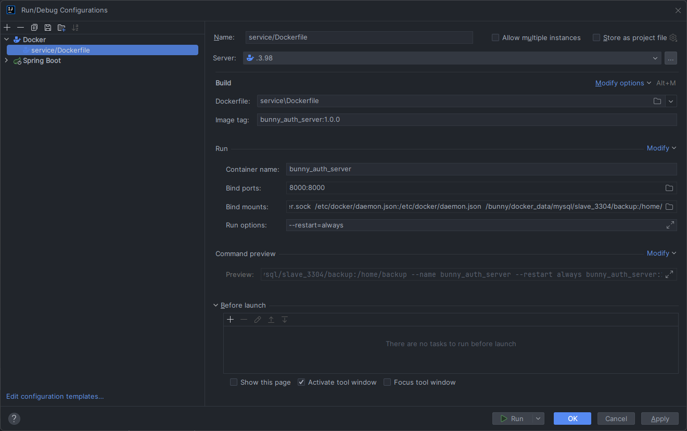

### 部署命令

仅供参考，实际的需要替换成你自己宿主机中的地址。

```bash
docker run -p 8000:8000 \
-v /usr/bin/docker:/usr/bin/docker \
-v /var/run/docker.sock:/var/run/docker.sock \
-v /etc/docker/daemon.json:/etc/docker/daemon.json \
-v /bunny/docker_data/mysql/slave_3304/backup:/www/root/backup \
-v /bunny/docker_data/server:/www/root/server \
--name bunny_auth_server --restart always bunny_auth_server:1.0.0
```

### 代码生成器

生成简单CURD后端文件和前端CURD页面使用`velocity`

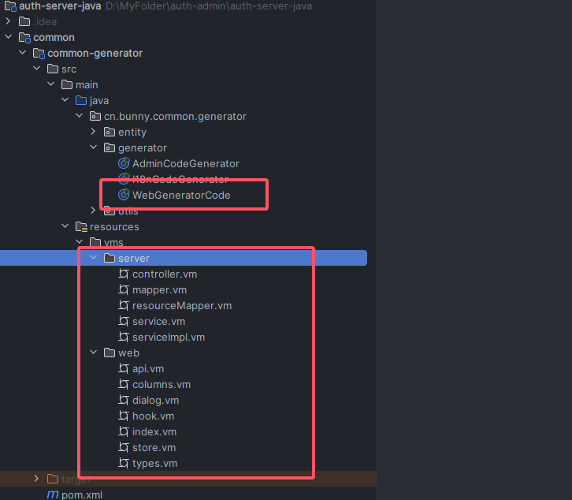

### 后端相关文件

直接导入

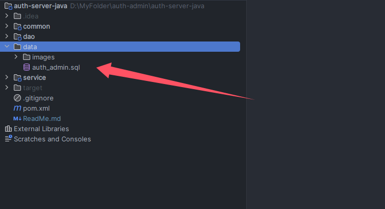

### 前端文件

有data.js可以生成权限相关内容，只是简单的生成

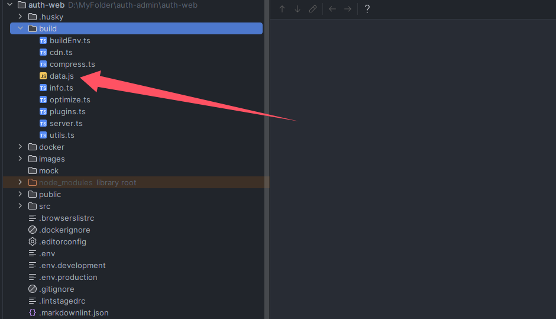

## 搭建MySQL

使用docker，开发环境端口号为3304，生产环境为3306
数据使用不区分大小写，因为涉及到quartz，但是quartz默认数据库名称包括表名都是大写的，我不喜欢，所以就设置了此项。

### 生产环境MySQL搭建

- 将之前的MySQL移除，名称为master【确保你的master没有或者不重要，以防不小心删除重要数据】

```shell
docker stop master
docker rm master

docker run --name master -p 3306:3306 \
-v /bunny/docker_data/mysql/master/etc/my.cnf:/etc/my.cnf \
-v /bunny/docker_data/mysql/master/data:/var/lib/mysql \
--restart=always --privileged=true \
   -e MYSQL_ROOT_PASSWORD=02120212 \
   -e TZ=Asia/Shanghai \
   mysql:8.0.33 --lower-case-table-names=1
```

### 开发环境搭建

```shell
docker stop slave_3304
docker rm slave_3304

docker run --name slave_3304 -p 3304:3306 \
   -v /bunny/docker_data/mysql/slave_3304/etc/my.cnf:/etc/my.cnf \
   -v /bunny/docker_data/mysql/slave_3304/data:/var/lib/mysql \
   -v /bunny/docker_data/mysql/slave_3304/backup:\
   --restart=always --privileged=true \
   -e MYSQL_ROOT_PASSWORD=02120212 \
   -e TZ=Asia/Shanghai \
   mysql:8.0.33 --lower-case-table-names=1
```

### 修改密码

 ```shell
docker exec -it mysql_master /bin/bash
mysql -uroot -p02120212
use mysql
ALTER USER 'root'@'%' IDENTIFIED BY "02120212";
FLUSH PRIVILEGES;
 ```

### my.cnf 配置

```shell
[mysqld]
skip-host-cache
skip-name-resolve
secure-file-priv=/var/lib/mysql-files
user=mysql

# 设置字符集
character-set-server=utf8mb4
collation-server=utf8mb4_unicode_ci

# 设置服务器ID（如果是复制集群，确保每个节点的ID唯一）
server-id=1

# 启用二进制日志
log-bin=mysql-bin

# 设置表名不区分大小写
lower_case_table_names = 1
```

## 安装Redis

### 配置文件

```
daemonize no 
requirepass 123456
appendonly yes
tcp-keepalive 300
```

### 运行Redis

```shell
docker pull redis:7.0.10
docker run -p 6379:6379 --name redis_master \
-v /bunny/docker_data/redis_master/redis.conf:/etc/redis/redis.conf \
-v/bunny/docker_data/redis_master/data:/data \
--restart=always -d redis:7.0.10  --appendonly yes
```

## 安装Minio

```sh
docker run -d \
  -p 9000:9000 \
  -p 9090:9090 \
  --name minio_master --restart=always \
  -v /bunny/docker/minio/data:/data \
  -e "MINIO_ROOT_USER=bunny" \
  -e "MINIO_ROOT_PASSWORD=02120212" \
  minio/minio server /data --console-address ":9090"
```

# 接口说明

为了方便开发，这个功能已经测试过了，也是为了线上能看到效果，邮箱验证码后端验证部分已经注释

## 请求接口

请求接口都是`/admin`前缀，部分接口会被忽略，忽略接口看下面。

所有分页请求内容都是通过路径传参方式

请求时需要带有token，只要前端在请求头中添加`token:内容`即可

采用SpringSecurity验证

## 接口忽略

### SpringSecurity接口忽略

这是相关拦截请求内容，如果要访问接口必须携带token，但是有些接口是不需要token的，不需要token就配置在这里。但是放在这里后，如果用户请求的地址是被忽略的，那么也就拿不到token也就拿不到登录相关信息。

获取用户自身的登录请求是不需要携带用户Id，只要有token去解析即可。

```java
// 排出鉴定路径
@Bean
public WebSecurityCustomizer webSecurityCustomizer() {
    String[] annotations = {
            "/", "/ws/**",
            "/*/*/noAuth/**", "/*/noAuth/**", "/noAuth/**",
            "/media.ico", "/favicon.ico", "*.html", "/webjars/**", "/v3/api-docs/**", "swagger-ui/**",
            "/*/files/**",
            "/error", "/*/i18n/getI18n",
    };
    return web -> web.ignoring().requestMatchers(annotations)
            .requestMatchers(RegexRequestMatcher.regexMatcher(".*\\.(css|js)$"));
}
```

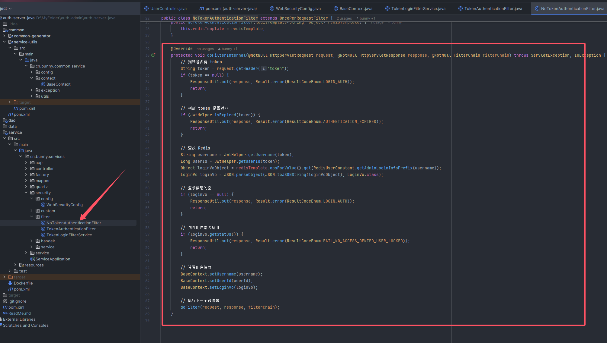

有些会被忽略的接口，凡是带有`noAuth`都是不需要验证的，但是要注意一点，不需要验证但是后端需要拿到登录相关信息是拿不到的。

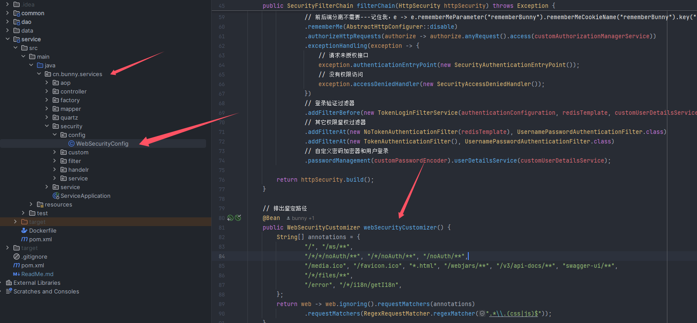

我是将用户相关请求使用SpringSecurity进行拦截，如果有相关匹配路径那么就会被拦截，此时接口参数中会带有token内容，拿到token进行解析，之后取出相关用户信息，比如用户Id、username等。

将这些信息拿出来后放到ThreadLocal中，存储在线程中，如果微服务中需要需要放在请求头中，因为微服务不在同一个线程中。这个操作适合单体或者是微服务中不需要请求其它微服务的方式。

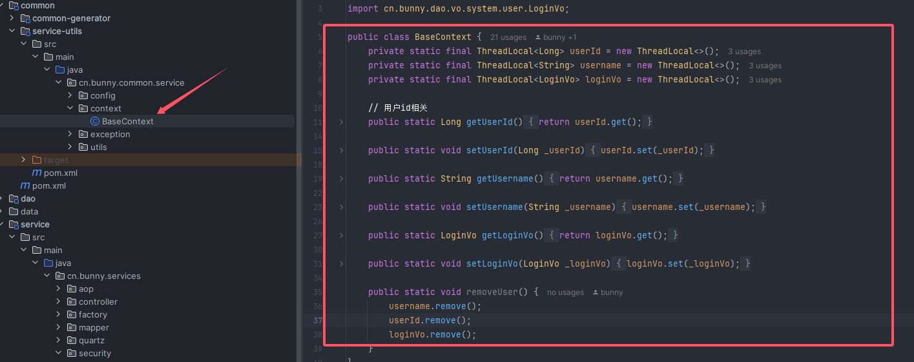

### 不需要管理接口

请求是会有不需要登录就能访问的接口，也需要不要被管理的接口

## 验证码验证忽略

为了公网上的展示，如果需要获取验证码比较的麻烦，如果你的需求和我一样那么可以在这里放开这些注释

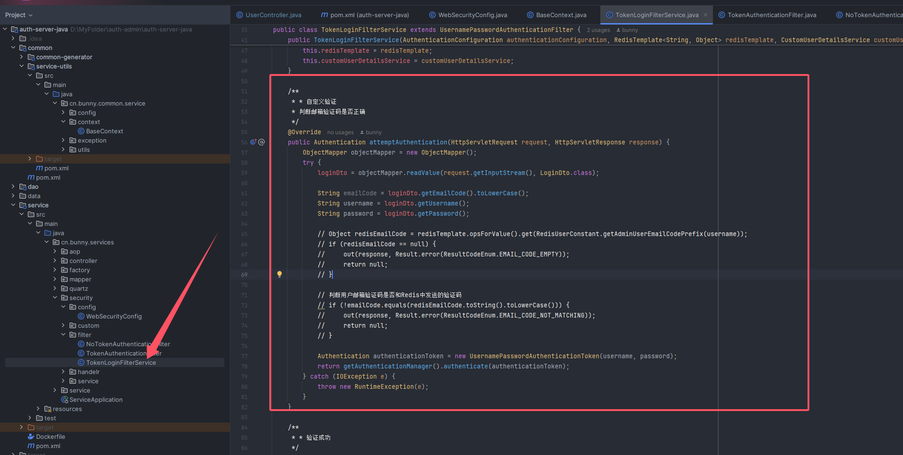

# 功能介绍

系统使用的是物理删除，但是引用了逻辑删除，使用mybatisPlus如果需要逻辑删除只需要将原先删除方法调用成mybatisplus自身的删除方法即可。

作为权限管理系统，校验功能已经路由功能都是由后端完成，后端使用SpringSecurity

系统权限功能使用RBAC模型

## 系统设置

### 系统菜单

当用户登录时会根据，当前角色获取自身的菜单路由，防止返回不该返回的页面，之后权限和角色关联，根据用户权限查询可以访问的菜单内容，如果权限中没有这个路径那么会告知`无权访问`。

管理员需要在配置时，配置菜单和角色之间的关系，用户也要和角色关联，角色会关联权限表，返回路由时只返回当前用户可以访问的菜单。

- 前端做递归，排序后端也做了
- 快捷排序，快捷禁用菜单
- 路由菜单图标需要再系统配置中添加菜单图标

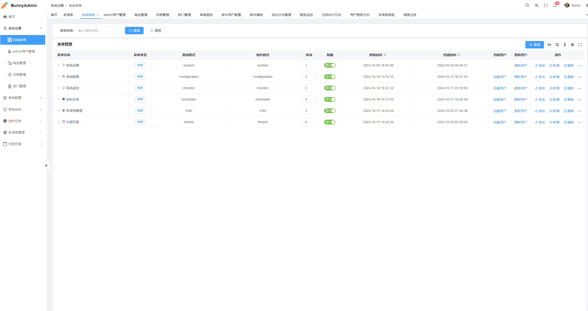

为菜单分配角色

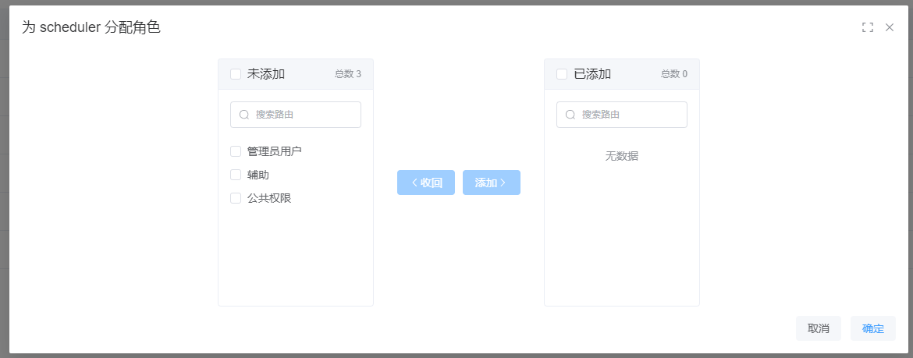

### 用户管理

强制下线就是将Redis中用户信息删除

用户禁用先改数据库之后将Redis中数据进行删除

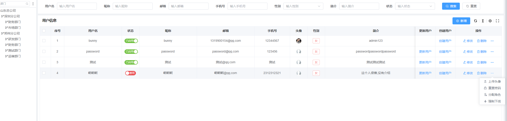

#### 关于用户管理事务问题

如果用户禁用失败或者删除Redis失败需要回滚事务，在Spring中，有集成的事务，只需要简单的配置下即可，

### 角色管理

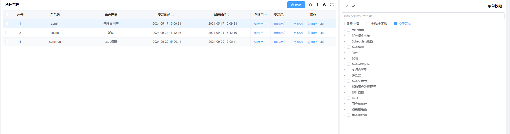

### 权限管理

权限管理可以设置父级内容，在前端文件中有`data.js`，可以自动生成权限相关内容。

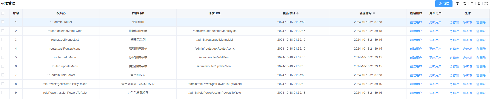

**前端文件**


### 部门管理

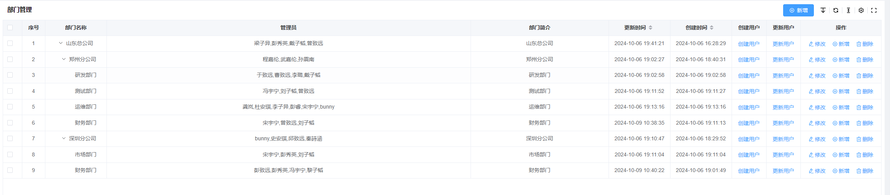

## 系统配置

### 菜单图标

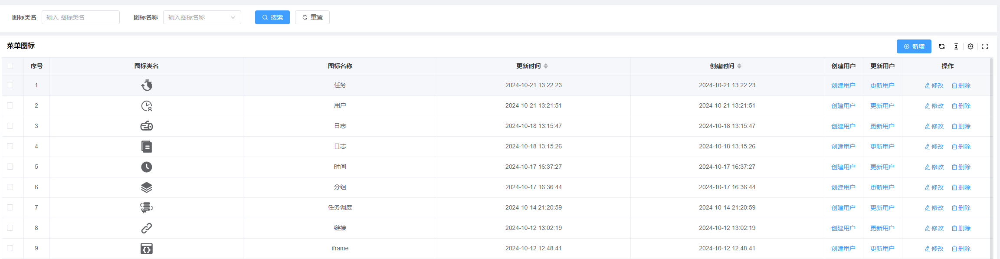

### 邮件用户配置

发送邮件时，如果没有选定用户会去找默认用户，如果默认用户也没有会报错。

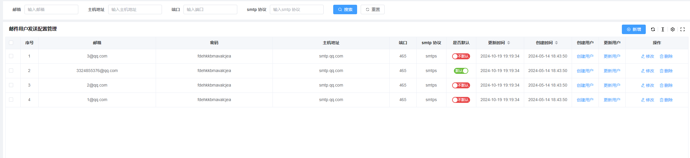

### 邮件模板

邮箱验证码，

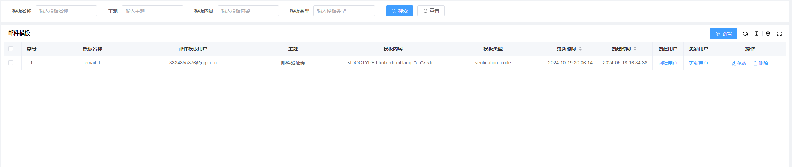

#### 模板类型说明

根据后端的枚举类进行返回

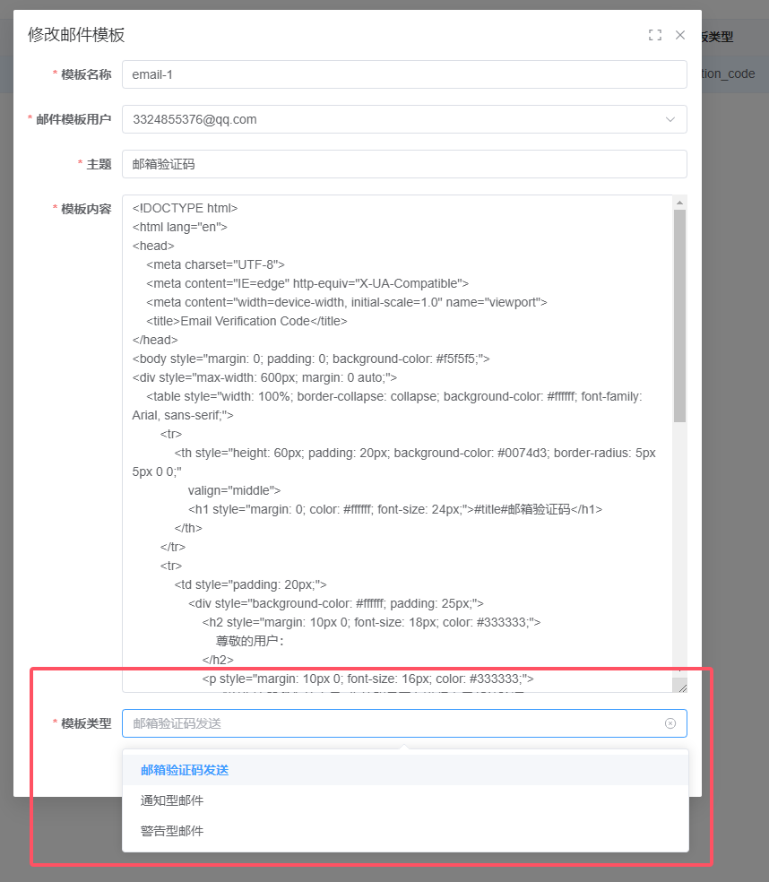

后端文件

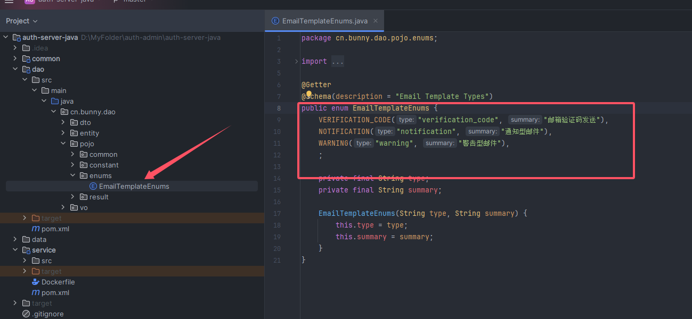

## 系统监控

### 服务监控

服务监控来自springboot中actuator框架

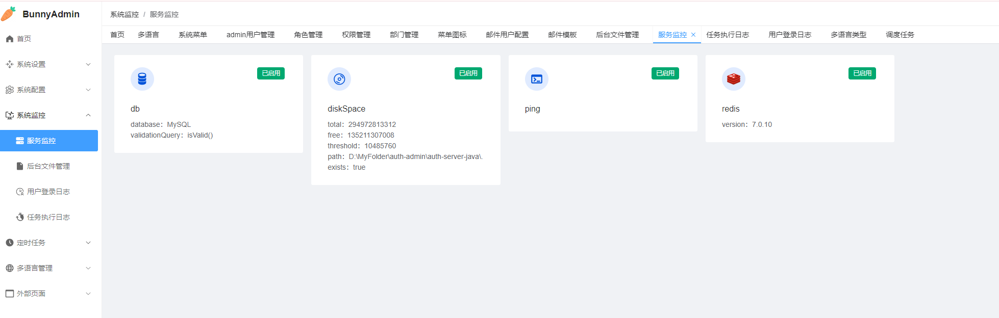

IDEA中也有集成只要使用了actuator包即可看到服务内容、健康检查等

详细参考官网API，当然如果需要后台服监控页面，德国工程师帮我们写了一个页面。

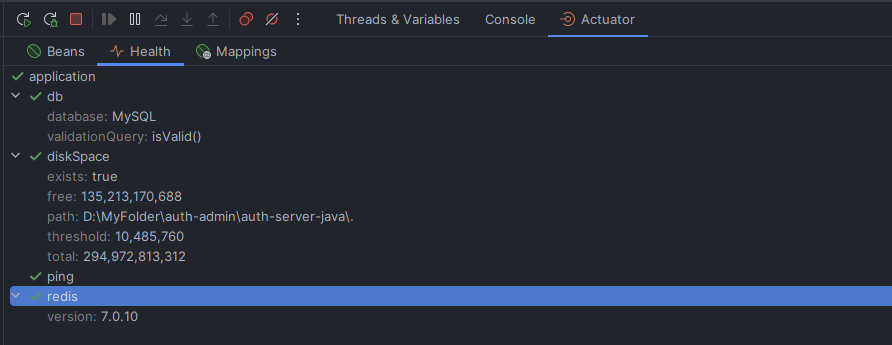

也可以看到当前的请求API有哪些

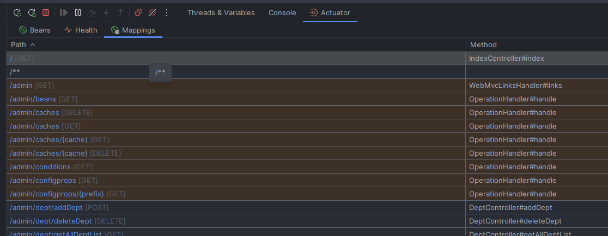

#### 相关admin服务包

或许在有些服务中不需要这个页面，有服务监控的功能，配置也简单，我之前我使用在这个项目中，和部分业务功能有些冲突，与其这样不如自己写个简单的也可以

```xml

<dependencies>
    <dependency>
        <groupId>de.codecentric</groupId>
        <artifactId>spring-boot-admin-starter-server</artifactId>
        <version>3.3.4</version>
    </dependency>
    <dependency>
        <groupId>de.codecentric</groupId>
        <artifactId>spring-boot-admin-starter-client</artifactId>
        <version>3.2.3</version>
    </dependency>
</dependencies>
```

### 后台文件管理

用户上传的文件和头像内容都在这里，文件存储位置在Minio中

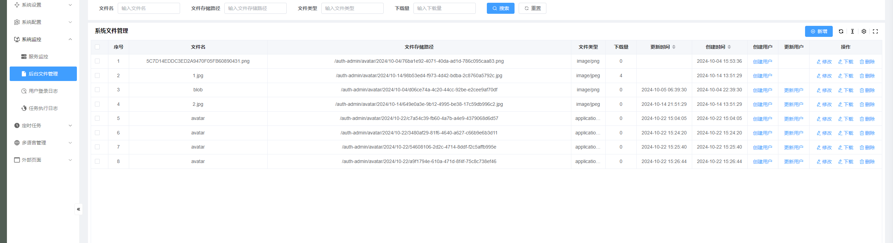

### 用户登录日志

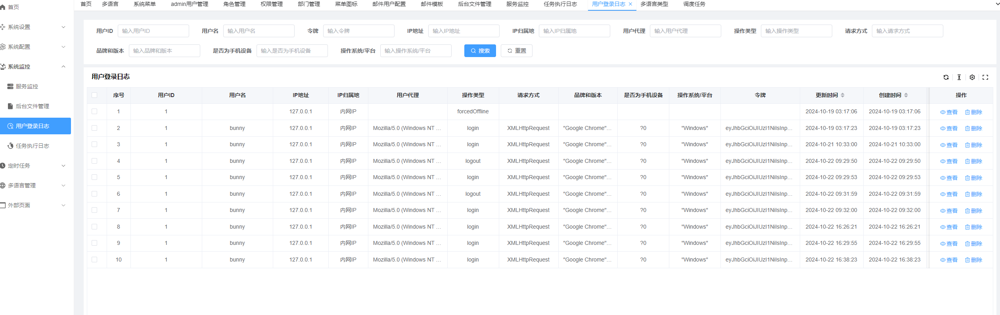

### 任务执行日志

当前设定的定时任务有关，目前有数据库备份，和简单的定时任务示例内容都在这，使用JS对象可视化，数据多时会有些卡顿

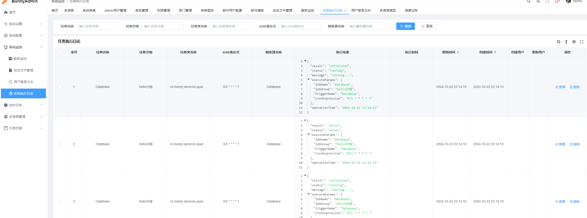

## 定时任务

### 调度任务

其实就是定时任务，集成框架quartz，持久化存储任务

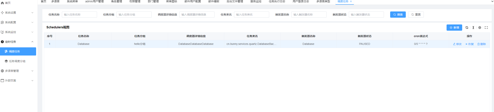

### 任务调度分组

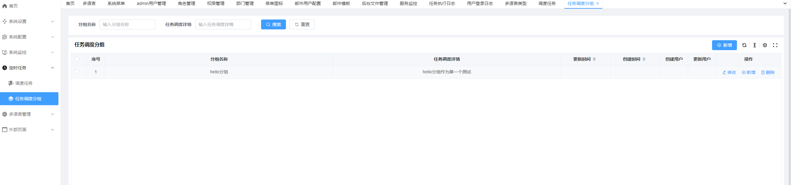

## 多语言管理

### 多语言

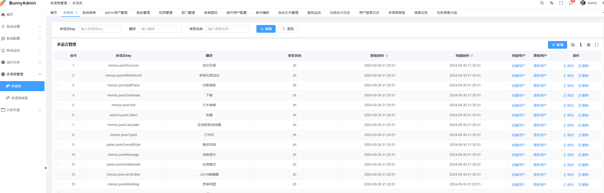

### 多语言类型

如果以后还需要其它语言可以在这个地方添加

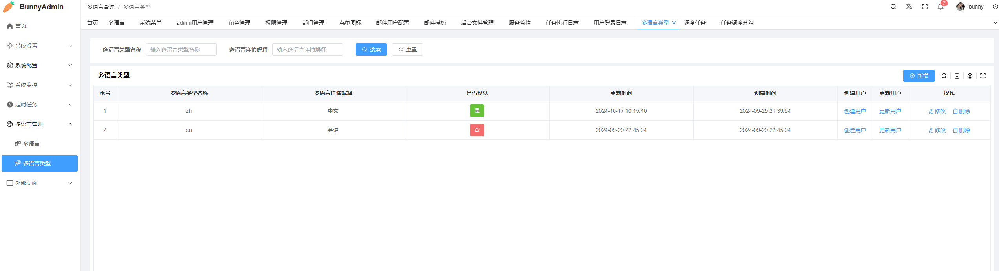

## 其它功能

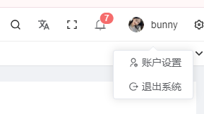

### 账户设置

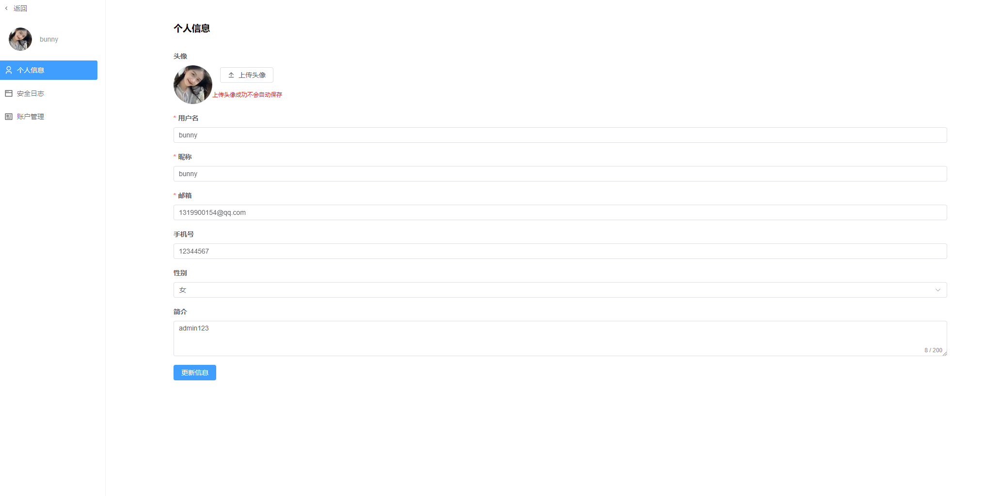

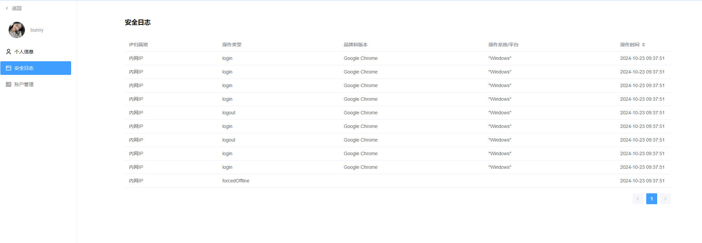

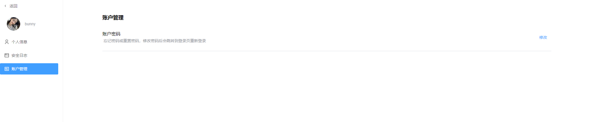

### 数据库事务

数据库事务在Springboot中只需要一个注解，通常我们还需要redis事务，在Redis中配置开启即可。


### 去除字符串空格

在项目中，会统一进行空白字符串去除，配置项也在config文件夹下

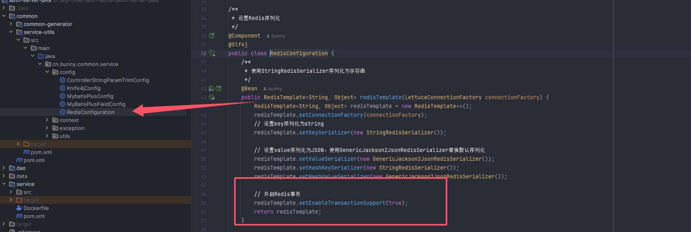

> 更多配置看这里
>
> 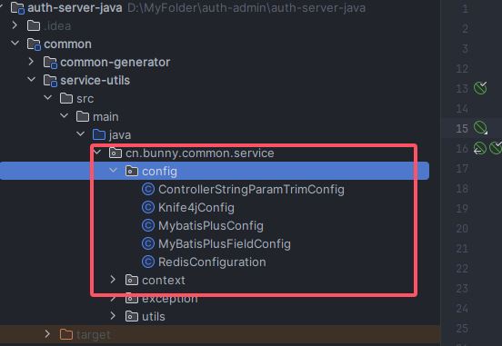

# 动态定时任务

使用`Quartz `数据存储在数据库中持久化存储.

所有的Quartz内容都放在这个目录中，因为前端需要知道有哪些定时任务，这时候又不能将数据添加到数据库中，如果以后需要更多的定时任务那么需要再数据库中添加，这样做很麻烦。

我们可以通过反射只要约定好内容，通过反射扫描的方式来获取这些可以使用的定时任务，反射的注解是这个：`@QuartzSchedulers(type = "test", description = "JobHello任务内容")`

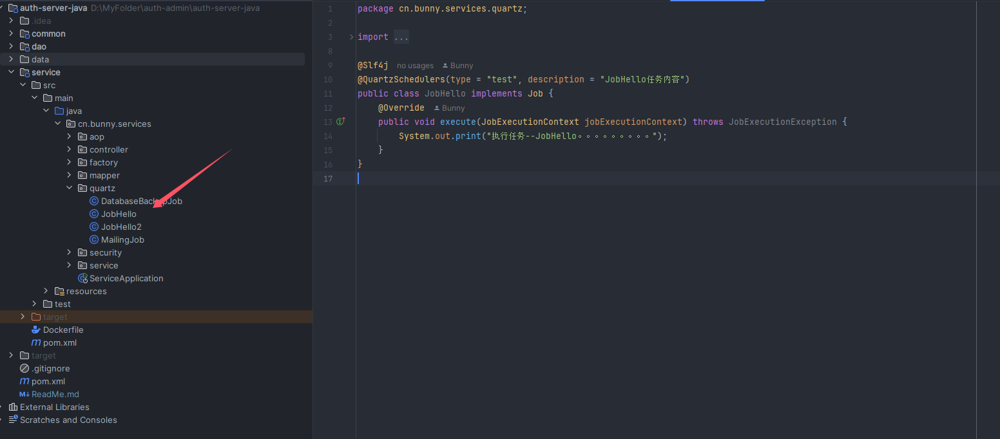

## 注解说明

扫描注解包，可以通过依赖注入的方式使用

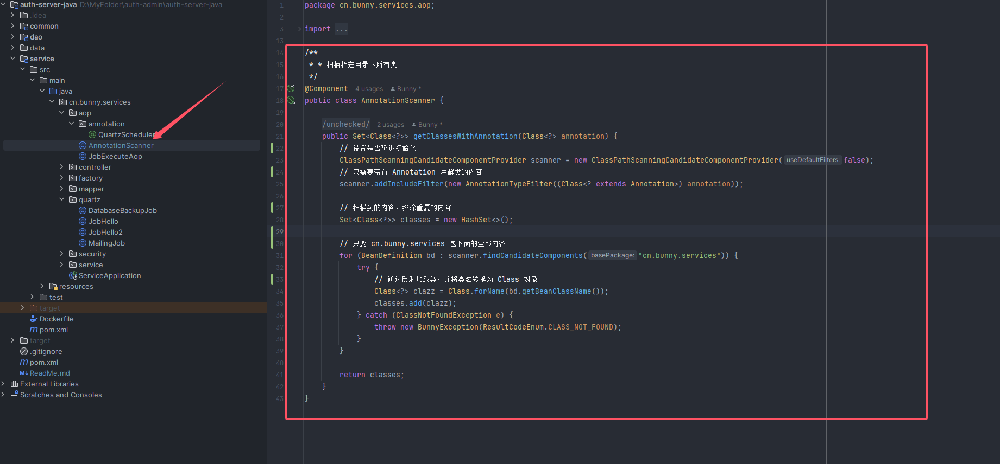

类型注解存放位置在下面。

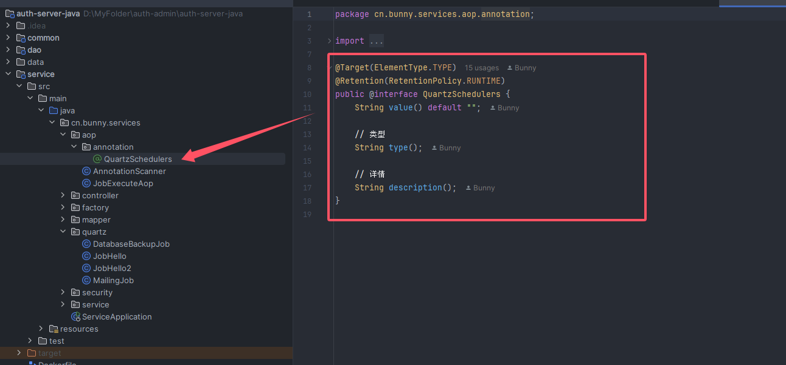

获取所有可用定时任务

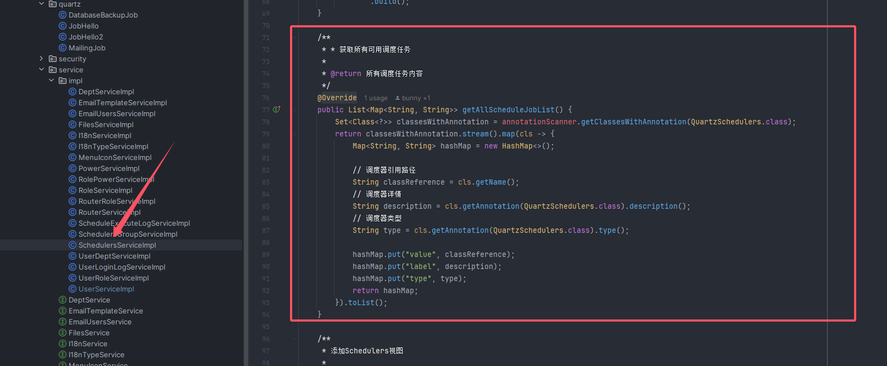

# Quartz 方法

## TriggerBuilder

`TriggerBuilder` 是一个用于构建 `Trigger` 实例的类。它提供了一系列方法来设置触发器的各种属性。以下是一些常用的方法：

1. `withIdentity(String name, String group)` 或 `withIdentity(TriggerKey triggerKey)`：设置触发器的名称和组名。

2. `startAt(Date startTime)`：设置触发器首次触发的时间。

3. `endAt(Date endTime)`：设置触发器最后一次触发的时间。

4. `withSchedule(ScheduleBuilder scheduleBuilder)`：设置触发器的调度计划，可以是简单重复、按日历重复等。

5. `forJob(JobKey jobKey)` 或 `forJob(String jobName, String jobGroup)`：指定触发器关联的作业（Job）。

6. `usingJobData(String key, String value)`：为触发器添加自定义数据。

7. `modifiedByCalendar(String calName)`：指定一个日历，用于修改触发器的触发时间。

8. `build()`：构建并返回最终的 `Trigger` 实例。

9. `withDescription(String description)`：为触发器设置描述信息。

10. `usingJobData(JobDataMap jobData)`：使用 `JobDataMap` 为触发器设置多个作业数据。

11. `withPriority(int priority)`：设置触发器的优先级。

12. `replaceTriggerKey(TriggerKey oldKey, TriggerKey newKey)`：替换触发器的键值。

## JobBuilder

`JobBuilder` 类用于构建 `JobDetail` 实例，它定义了要执行的作业（Job）的属性。以下是一些常用的方法：

1. `withIdentity(String name, String group)` 或 `withIdentity(JobKey jobKey)`：设置作业的名称和组名。

2. `storeDurably()`：当作业没有触发器时，仍然允许作业被存储。这对于持久作业（即不被触发器触发，但可以手动调度的作业）很有用。

3. `requestRecovery()`：指示Quartz在作业执行失败或调度器重启时尝试恢复作业。

4. `usingJobData(JobDataMap jobData)`：为作业添加自定义数据。

5. `usingJobData(String key, String value)`：为作业添加单个自定义数据。

6. `ofType(Class<? extends Job> jobClass)`：指定作业的类型（实现 `Job` 接口的类）。

7. `build()`：构建并返回最终的 `JobDetail` 实例。

8. `withDescription(String description)`：为作业设置描述信息。

9. `usingJobData(JobDataMap jobData, boolean merge)`：添加自定义数据，并指定是否与现有的 `JobDataMap` 合并。

10. `build()`：构建并返回最终的 `JobDetail` 实例。

# 展望未来

1. 首页看板内容
2. 服务器资源使用可视化展示
3. 将文件上传服务改成本地的oss，Minio感觉不需要未来会删除