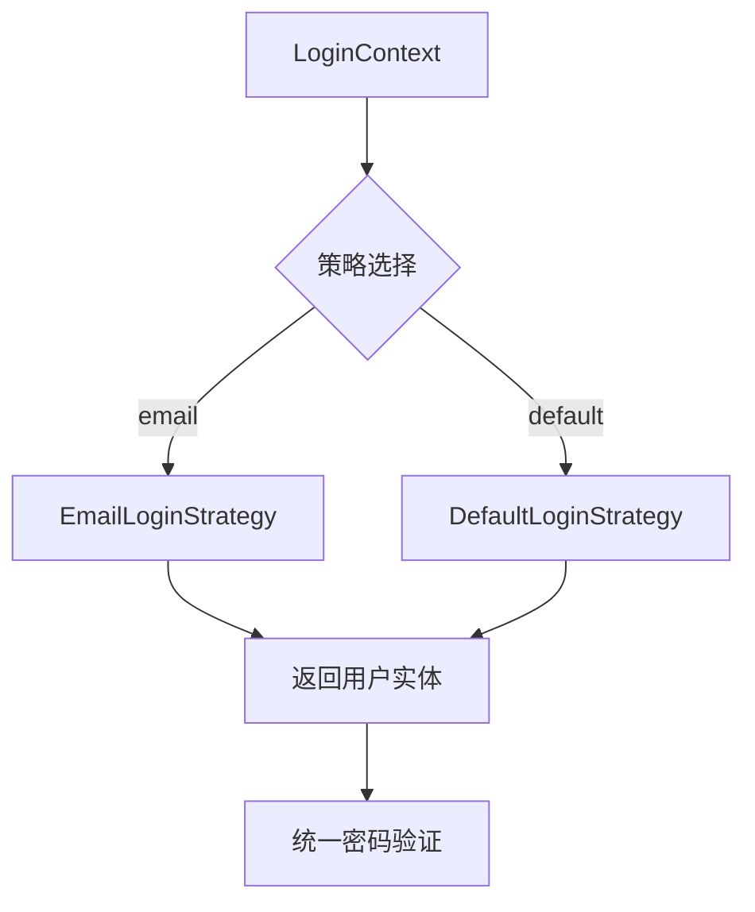

# 登录模块策略模式实现

通过 `LoginStrategy` 接口实现多登录方式动态切换，支持邮箱登录、默认账号密码登录、邮箱登录等扩展。

## 核心组件

| 组件                     | 说明                   |
|------------------------|----------------------|
| `LoginStrategy`        | 策略接口，定义 `login` 方法规范 |
| `LoginContext`         | 策略上下文，根据输入动态选择具体策略   |
| `EmailLoginStrategy`   | 邮箱登录策略（需验证邮箱相关逻辑）    |
| `DefaultLoginStrategy` | 默认账号密码登录策略（仅作基础用户查询） |

## 快速开始

### 1. 策略注册

```java
// 初始化所有策略（可扩展）
// 策略注册（初始化登录策略，如果有需要添加策略放在这里）
HashMap<String, LoginStrategy> loginStrategyHashMap = new HashMap<>();
// 默认的登录方式
loginStrategyHashMap.put(LoginEnums.default_STRATEGY.getValue(), new DefaultLoginStrategy(userMapper));
// 注册邮箱
loginStrategyHashMap.put(LoginEnums.EMAIL_STRATEGY.getValue(), new EmailLoginStrategy(redisTemplate, userMapper));
```

### 2. 执行登录流程

```java
public LoginVo login(LoginDto loginDto) {
    // 1. 策略路由
    LoginContext context = new LoginContext(strategies);
    
    // 2. 执行具体策略 统一安全验证
    AdminUser user = context.executeStrategy(loginDto); 
    
    // 验证登录逻辑
    if (user == null) throw new UsernameNotFoundException(ResultCodeEnum.USER_IS_EMPTY.getMessage());

    // 数据库密码
    String dbPassword = user.getPassword();

    // 用户登录密码
    String password = loginDto.getPassword();

    if (!passwordEncoder.matches(password, dbPassword)) {
        throw new UsernameNotFoundException(ResultCodeEnum.LOGIN_ERROR.getMessage());
    }

    // 判断用户是否禁用
    if (user.getStatus()) {
        throw new UsernameNotFoundException(ResultCodeEnum.FAIL_NO_ACCESS_DENIED_USER_LOCKED.getMessage());
    }

    // 3. 返回Token等业务逻辑
    return userUtil.buildLoginUserVo(user, loginDto.getReadMeDay());
}
```

## 设计规范

### 策略实现要求

- 各策略 **只需关注自身特有逻辑**（如邮箱验证码校验）
- **禁止** 在策略中处理账号密码验证（由业务层统一处理）
- 返回的 `AdminUser` 对象应为完整实体

### 上下文流程



## 扩展新策略

1. 实现 `LoginStrategy` 接口
2. 在策略映射中注册新策略
3. 通过 `LoginEnums` 添加类型常量
